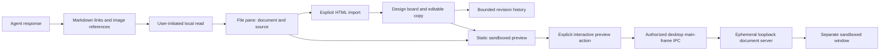

# Rich artifacts and design workspace: implementation review

## Goal and approach

Let any configured capable model deliver portable reports, images, diagrams, and design prototypes. Keep concise summaries in chat, editable source in project files, and rich views in the app. Extend the existing Design board rather than introduce a competing workspace.

General reporting behavior belongs in the shared TypeScript and Rust prompts. Repository-specific specification maintenance belongs in AGENTS.md. SPEC.md records acceptance criteria and implemented versus unverified behavior; personal memory is not a substitute for product policy.

## Architecture

## Implemented

- Local Markdown links open inside the app using workspace/worktree context.
- Raster image references require an explicit Load image action; preview bytes are bounded and signatures checked.
- HTML/SVG static previews retain source access and viewport controls. Mermaid diagrams retain source and error fallback.
- Desktop interactive previews use a separate sandboxed window with independent response CSP and no preload, Node integration, app bridge, or persistent session.
- Only authorized application main frames can invoke preview IPC; source is capped at 1 MB UTF-8.
- Preview requests, navigation, popups, permissions, and downloads are restricted. Replacement and owner-close paths shut down windows and transport.
- HTML import creates an editable copy under nekko-designs/. Refinement and restore retain up to ten previous HTML snapshots. Restore preserves the replaced version.
- Shared prompts encourage substantial reports with sources, assumptions, trade-offs, and next steps. AGENTS.md requires specification updates alongside behavior changes.

## Verified evidence

- Desktop regression: 372 tests passed.
- Core regression: 412 tests passed.
- Host regression originally passed 575 tests with two failures: an intentionally stale prompt golden fixture (subsequently corrected and verified), and a Windows symlink-permission error in the user-data migration fixture.
- Focused host tests verify raster validation, revision bounds, import persistence, restored editable-file contents, original-file preservation, and rejection of missing imports.
- Production desktop build and typecheck passed before the latest test-only additions.
- Actual Electron/Chromium probe verifies inline script execution under a restrictive parent CSP, rejected external fetch, absence of app bridge/Node require/opener, navigation/popup denial, replacement cleanup, and owner-close server shutdown.

Reproduce the probe by launching `apps/desktop/scripts/preview-security.cjs` with the installed Electron executable, with ELECTRON_RUN_AS_NODE unset. This is an isolated test window, not the user's running app.

## Not yet complete

- Full UI import/restore/source-edit verification and matching screenshots/recordings.
- Exhaustive malicious-document testing; the current probe is focused evidence, not a security audit.
- Element-level visual editing, richer design export, and native mobile parity.
- Interactive web-client transport (currently desktop-only with explicit fallback).
- Actual image content delivered to models through tool results. Displaying a screenshot to the user does not prove a model inspected it.
- Mascot cross-platform visual evidence from the earlier batch sharing this PR.

## Release recommendation

Keep PR #310 in draft until UI acceptance and required visual evidence are complete. CI success alone is not sufficient. Preserve the Windows permission failure as a known environment limitation unless CI reproduces a product failure. Do not weaken the app CSP, enable Node in prototypes, or silently fetch remote resources to make examples render.

## Sources

- `SPEC.md` — product behavior and outstanding scope.
- `apps/desktop/src/main/artifactPreview.ts` — transport, authorization, lifecycle.
- `apps/desktop/src/previewPolicy.ts` — request and response policy.
- `apps/desktop/scripts/preview-security.cjs` — real Electron probe.
- `packages/host/src/design.ts` and `design-revisions.ts` — import, persistence, history.
- `packages/host/src/design-import.test.ts` — non-destructive import/restore checks.
